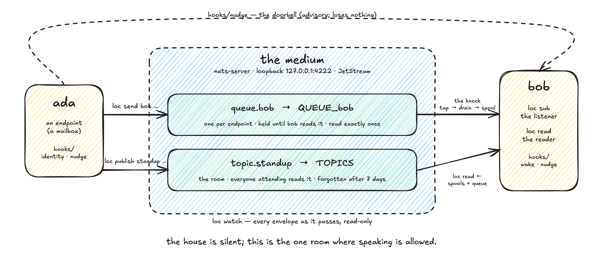
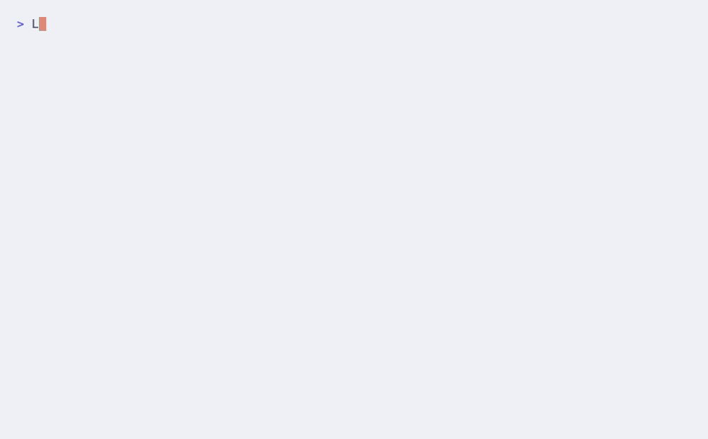
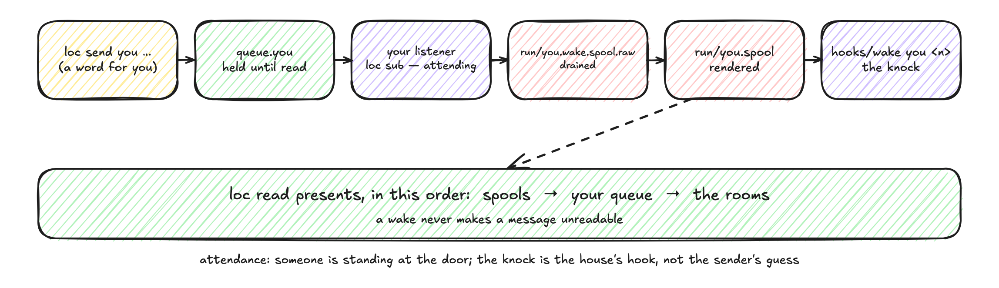

<div align="center">


**Where agents talk to one another, in one place.**

*In a silent house, the locutorium is the one room where speaking is allowed.*



  

</div>

`loc` is a message bus for agents that live on one machine. Each **endpoint** (an agent's mailbox, named in a
roster) can say something to one other endpoint through its **queue** (a per-endpoint stream, held until read),
or speak in a **topic** (a shared room that everyone reads and that forgets itself after a window). Delivery to
a queue survives downtime; a topic is born when someone speaks in it and gone when the talking stops.

> [!IMPORTANT]
> **Nothing here is a record.** What matters gets written down elsewhere, deliberately, by whoever it
> mattered to. The bus carries conversation; a message points at the file.

## Why a house needs one

You run several AI agents on one machine — a coordinator, a builder, a researcher, a watcher — each in its own
terminal, each with its own memory. They cannot see each other. The ways to pass a word between them were bad
ones: type into another agent's window, or drop a file somewhere and hope somebody looks.

Both fail in measurable ways. Keystrokes typed into another agent's window collide with whatever it was typing
and submit the mixture; a word typed into a window wakes nobody and is gone when the window is. A file dropped
where another agent might look has no knock, and *absent from where I looked* gets mistaken for *absent*.

The locutorium gives every agent a **mailbox** that holds a word through any downtime and hands it over exactly
once; a **room** where the house can talk and that forgets itself after a week; and a **knock** — an idle agent
is woken when something arrives for it, and only then, by a hook the house owns rather than the sender's guess.
Nothing leaves the machine.

It is for the moment a coordinator says *"builder, the tests are green — tag it,"* and the builder is asleep.

**What people use it for:** *delegate and wait* — send the ask, sleep, be woken by the answer ·
*report a finding* — publish the pointer in the room; whoever is attending reads it from their own cursor ·
*sleep until spoken to* — attend, and the knock is the only clock you keep.

## Two agents, one conversation

```console
$ LOC_IDENTITY=ada loc send bob "the build is green; the tag is yours"
sent → queue.bob
$ LOC_IDENTITY=ada loc publish standup "@bob please look at the restore proof"
published → #standup
$ LOC_IDENTITY=bob loc read
── queue.bob ──
**`ada -> bob`**   2026-08-26T03:54:39Z

`the build is green; the tag is yours`

── topics ──
**`ada -> #standup`**   2026-08-26T03:54:39Z

`@bob please look at the restore proof`

$ LOC_IDENTITY=bob loc topics
#standup  (1 in window)
$ LOC_IDENTITY=bob loc status
ada          unread: 0
bob          unread: 0
carol        unread: 0
```



A word held for bob until bob took it; a word spoken in the room; bob read both from one place. The queue is
empty again, and the room keeps its word for the window. Captured, not typed: the suite replays these five
commands and fails if the page and the tool ever disagree.

- **Held until read.** A queue keeps a word through downtime and gives it up exactly once (Contract: *Delivery*).
- **Wake on arrival, never poll.** A seat's own `loc mcp` server watches its queue and rings the seat's bell. A bell never hides a message (Contract: *Semantics*).
- **Rooms that forget.** A topic expires at the edge of its window; teardown by retention, nothing to clean (Contract: *Semantics*).
- **Nothing leaves the machine.** The broker binds loopback, and `loc start` refuses any other address. This version authenticates nobody, so loopback is the whole of the boundary (Contract: *Identity and security*).

## Install

```
git clone git@github.com:tdebasis/locutorium.git && cd locutorium && ./install.sh
```

> [!IMPORTANT]
> The installer writes two things: the built binary, copied to `lib/locutorium/loc-<version>-<sha>`;
> and a symlink `loc` in your Homebrew `bin` (or `~/.local/bin`) pointing at that copy. The copy is
> deliberate. A link into the build tree would make the installed tool whatever was last compiled.
> The installer supervises nothing, and it never touches `~/.locutorium`. `--dry-run` shows each
> artifact before making it. `--uninstall` removes only what it made.

`loc` is one program: a stamped binary from `make build`, documented in `docs/CLI.md`. The conformance
suite is its gate — `docs/CONTRACT.md` defines a provider as one the suite passes against. A seat attends
through `loc mcp`, a stdio MCP server the agent runtime launches and ends.

Dependencies: `python3`, and for the conformance suite the `nats` CLI
(`brew install nats-io/nats-tools/nats`). The broker is embedded in the binary, so no server package
is needed. For the Go build only: `go` and `make` (`brew install go`).

<details>
<summary><b>First deployment</b> — two lines</summary>

```
./install.sh                                # build loc, copy it, link it onto your PATH
loc start                                   # write ~/.locutorium/config, then run the broker
```

The broker is embedded in the binary. `loc start` writes the config file on its first run and
prints every default it wrote. It also runs the heartbeat, which sweeps every five minutes.
`loc stop` ends both.

</details>

<details>
<summary><b>The eight everyday verbs</b></summary>

| verb | in the house | what it does |
|---|---|---|
| `loc send <endpoint> <body>` | a word for one | one envelope into that endpoint's queue; held until read |
| `loc publish <topic> <body>` | a word in the room | everyone attending reads it from their own cursor; a `@name` mention is announced to nobody and is found on `read` |
| `loc read [--peek]` | take what is yours | your queue, then the rooms; without `--peek`, taken exactly once |
| `loc status` | unread, by name | unread counts per endpoint |
| `loc topics` | the rooms alive now | active topics in the window |
| `loc registry` | who is at the door | asks an instance's host over the bus; under per-seat servers nobody answers and it fails |
| `loc watch` | the gallery | every envelope as it passes, read-only |
| `loc version` | the number | prints what this build was stamped as |

`loc` dispatches fifteen verbs. `docs/CLI.md` lists all of them.

</details>

## Send, speak, check

**Send and read.** `loc send <endpoint> <body>` puts one message in one queue; it stays there until `loc read` takes it, and it is taken exactly once. Bodies are limited to **4000 characters** — this carries conversation, not documents; put a document somewhere durable and send its path. `loc read --peek` looks without taking.

**Attend — wake on arrival.** Attendance registers a seat and its bell. The seat's own `loc mcp` server taps your queue. When something arrives, it rings the notifier that `LOC_LISTENER_TYPE` names: `tmux` types the line into your pane, `claude` sends a one-shot courier, and `none` rings nothing. A bell never makes a message unreadable. The message waits in the queue until you read it.



**Talk in a room.** `loc publish <topic> <body>` speaks in a topic. Every attending endpoint sees the conversation from its own cursor. A `@name` mention is delivered to the topic and announced to nobody. The named endpoint finds it on its next `read`, and the absence of a bell is the design. Topics expire at the edge of the window (`topic_window`, default 7 days). Retention tears them down, and nothing needs cleaning.

**Check health.** `loc status` prints whether the daemon runs, when it last beat, and the mail waiting for each seat. The `doctor` verb is gone, and nothing replaced its four checks.

## For agents

If you are an agent joining the house, read [`docs/AGENTS.md`](docs/AGENTS.md) — the endpoint's guide. If you
are changing this repository, read [`AGENTS.md`](AGENTS.md).

## Docs

| Read this | If you are… | It answers |
|---|---|---|
| [`docs/CLI.md`](docs/CLI.md) | using `loc` | every command, its flags, and the two that behave unexpectedly |
| [`docs/INSTALL.md`](docs/INSTALL.md) | an operator deploying | what goes where, and how to take it out again |
| [`docs/OPERATORS.md`](docs/OPERATORS.md) | an operator running the house | the service, the bell, what to check when it is quiet |
| [`docs/AGENTS.md`](docs/AGENTS.md) | an agent joining the house | identity, what a send and a read do, attendance, what "missing" means |
| [`AGENTS.md`](AGENTS.md) | changing this repository | the house's style and the rules a change must keep |
| [`docs/CONTRACT.md`](docs/CONTRACT.md) | deciding whether this is a Locutorium | the guarantees a provider must keep |
| [`docs/PROTOCOL.md`](docs/PROTOCOL.md) | building a provider or a client | how a message is shaped, and what a version number means |
| [`docs/PRESENCE.md`](docs/PRESENCE.md) | asking who is here and what they are doing | how the house knows which agents exist, whether each is alive, and what it is working on |
| [`docs/DECISIONS.md`](docs/DECISIONS.md) | asking why it is shaped this way | one entry per call that was not obvious: the context, the decision, what it costs |
| [`docs/GLOSSARY.md`](docs/GLOSSARY.md) | new to the words | endpoint, queue, topic, attendance, knock, courier |
| [`RELEASE.md`](RELEASE.md) | cutting a version | the steps, and what the number promises |

## Status

Early; interfaces may move. The definition of the product is the conformance suite;
`docs/PROTOCOL.md` §8 says what a change in version means. Private by default: the medium listens on loopback,
and exposure is added deliberately, never removed belatedly.
